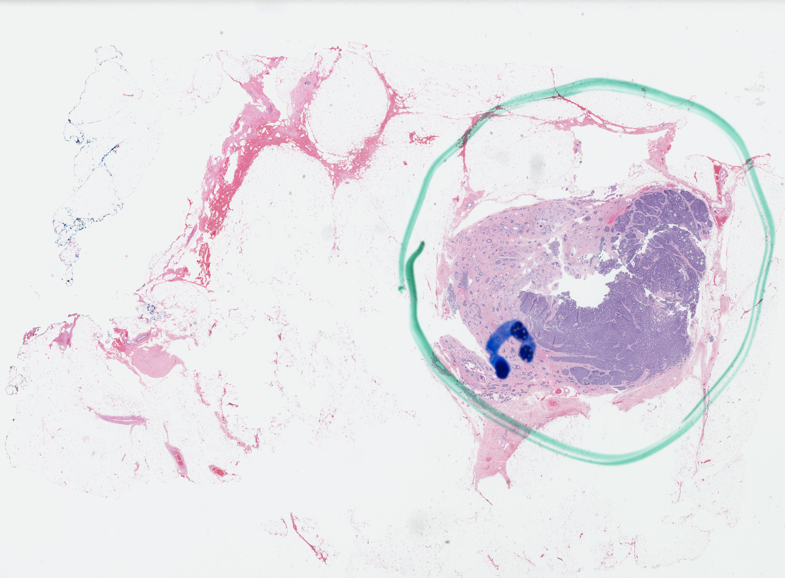
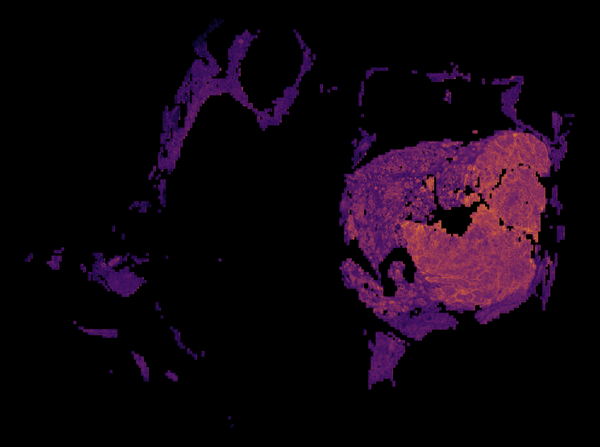

<!-- Title -->
<div align="center">
<h1>MISO: A deep learning-based multiscale integration of spatial omics with tumor morphology</h1>

<!-- Short description -->
Pre-print available on [biorXiv](https://www.biorxiv.org/content/10.1101/2024.07.22.604083v1.abstract).

</div>

## Table of Contents

- [How to install](#how-to-install)
- [Data collection and preprocessing](#data-collection-and-preprocessing)
  - [Downloading data](#downloading-data)
  - [Preprocessing](#preprocessing)
  - [Pre-extracted features](#pre-extracted-features)

## How to install

This code relies on python 3.9.
To install openslide, do:
```bash
apt-get update -qq && apt-get install openslide-tools libgeos-dev -y 2>&1
```

Then to install miso in a dedicated environment:
```bash
conda create --name miso_env python=3.9
conda activate miso_env
pip install -e .
```

## Data collection and preprocessing

### Downloading data

Public 10 Genomics Visium samples are available to download on [10 Genomics's website](https://www.10xgenomics.com/datasets) (filter by "Spatial Gene Expression").
For example purposes, we make available tools to process such samples and make available the outputs of the samples:
- `Human Colorectal Cancer, 11 mm Capture Area (FFPE)`.
- `Human Lung Cancer, 11 mm Capture Area (FFPE)`.
- `Human Ovarian Cancer, 11 mm Capture Area (FFPE)`.

For a given sample, you will need to download:
- The `filtered_feature_bc_matrix.h5`
- The `spatial` folder
- The H&E image `tissue_image.tif` (be careful to use the full resolution image and not the CytAssist view, if you are using CytAssis samples)

The dataset HER2ST ([Andersson et al](https://www.nature.com/articles/s41467-021-26271-2)) can be downloaded following instruction given in the [repository](https://github.com/almaan/her2st?tab=readme-ov-file). 

### Preprocessing of Visium data

1. Re-write the H&E image in a pyramidal format compatible with the `openslide` library using the script `miso/data/processing/rewrite_slide.py`.

For instance, after downloading the Human Colorectal Cancer in `PATH_TO_RAW_DATA`, you can run

```python miso/data/processing/rewrite_slide.py --path_visium PATH_TO_RAW_DATA/CytAssist_11mm_FFPE_Human_Colorectal_Cancer/spatial --path_slide PATH_TO_RAW_DATA/CytAssist_11mm_FFPE_Human_Colorectal_Cancer/CytAssist_11mm_FFPE_Human_Colorectal_Cancer_tissue_image.tif --path_output_folder PATH_TO_PROCESSED_DATA/CytAssist_11mm_FFPE_Human_Colorectal_Cancer```

This will save the new file `CytAssist_11mm_FFPE_Human_Colorectal_Cancer_tissue_image_pyr.tif` in `PATH_TO_PROCESSED_DATA/CytAssist_11mm_FFPE_Human_Colorectal_Cancer`. 

2. Run the pre-processing script `miso/scripts/process_data.py`:

```python miso/scripts/process_data.py --path_visium PATH_TO_RAW_DATA/CytAssist_11mm_FFPE_Human_Colorectal_Cancer/ --path_slide PATH_TO_PROCESSED_DATA/CytAssist_11mm_FFPE_Human_Colorectal_Cancer/CytAssist_11mm_FFPE_Human_Colorectal_Cancer_tissue_image_pyr.tif --path_output_folder PATH_TO_PROCESSED_DATA/CytAssist_11mm_FFPE_Human_Colorectal_Cancer --level 1 --knn 37```

This script will:
- Select 224 x 224 pixels tiles centered on each spots that passed Space Ranger's QC.
- For each tile, we use a pre-trained ViT-16 feature extractor to extract features both at the tile level and at each patch of size 16 x 16 pixels. By default, we use the [phikon model available on huggingface](https://huggingface.co/owkin/phikon).
- A list of neighbors for each tiles is computed.
- Rewrite the counts into numpy files.

### Preprocessing of HER2ST data

Once downloaded, the data folder `PATH_TO_HER2ST_DATA`  contains four subfolder: `count-matrices`, `images`, `meta` and `spot-selection`. To extract tile and subtile features, run

```python miso/scripts/process_her2st.py --path_dataset PATH_TO_HER2ST_DATA```

This will create a fifth subfolder `processed_data` in `PATH_TO_HER2ST_DATA`.

## Training

To train a model you can run the scripts `miso/train.py`.

To do so you can use a config file in the folder `confs` and specify it with the command-line argument `--config-name`, e.g.

```python miso/train.py --config-name train_her2st.yaml```

## Benchmark

Performances of the models trained on HER2ST can be compared to the extensive benchmark carried by Wang et al. [^1], using the [source data](https://static-content.springer.com/esm/art%3A10.1038%2Fs41467-025-56618-y/MediaObjects/41467_2025_56618_MOESM4_ESM.xlsx) provided in the paper. The default config `train_her2st.yaml` makes use of the same split, saved in `miso/assets/splits_benchmark_her2st.pkl`.

[^1]: Wang, C., Chan, A. S., Fu, X., Ghazanfar, S., Kim, J., Patrick, E., & Yang, J. Y. (2025). Benchmarking the translational potential of spatial gene expression prediction from histology. Nature Communications, 16(1), 1544. ([Link to the publication](https://www.nature.com/articles/s41467-025-56618-y)).


## Distillation

Once a model is trained, you can use it to generate pseudolabels for distillation with `miso/distillation/generate_distillation_labels.py`.

For instance, to generate pseudolabels with a model trained with config `miso/confs/train.yaml` in the same folders as raw counts, run
```python miso/distillation/generate_distillation_labels.py --config-name=train.yaml```


It is then possible to train a weakly-supervised model for super-resolved prediction of gene expression by launching

```python miso/train.py --config-name=distil.yaml```

## Super-resolution

The notebook `notebooks/super-resolved-inference` shows how to run super-resolution inference on Her2ST and on an example slide from TCGA. When computing super-resolved gene expression, the tiling grid might be apparent on the resulting heatmap because the features from a given patch depend on the whole tile content, as a result of self-attention. To avoid this effect, the model is applied to a tiling with overlap, controlled by a stride parameter. Smaller strides will give a smoother result, at the expense of a larger computational cost. Below are examples of predicted KRT8 expression on the example slide from TCGA, using strides of 112 pixels and 56 pixels respectively, for a tile size of 224.

<figure>
  <figcaption>Thumbnail of slide TCGA-A1-A0SB-01Z-00-DX1.B34C267B-CAAA-4AB6-AD5C-276C26F997A1.svs:</figcaption>
  
</figure>

<figure>
  <figcaption>Super-resolved inference of KRT8 expression, stride = 112:</figcaption>
  
</figure>

<figure>
  <figcaption>Super-resolved inference of KRT8 expression, stride = 56:</figcaption>
  
</figure>
